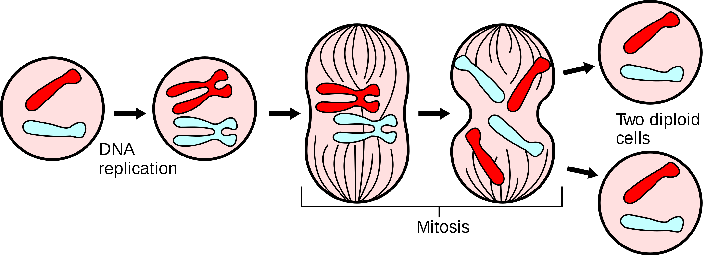

This week I have created a simulator for cellular mitosis. A naive definition of cellular mitosis would be the reproduction of cells through the process of copying DNA and splitting the parent cell into two child cells. To help illustrate the mitosis process, consider the following image pulled from Wikipedia:



In our program, we are going to measure the performance of a function named 'simulate' whose sole purpose is to run through the mitosis lifecycle 'N' number of times. This program will demonstrate how cells (and our program itself) grow at an exponential rate. The rate of growth can be best described as:


```latex
%%latex
\begin{equation}
  f(n) = 1 \times 2^{n}
\end{equation}
```


\begin{equation}
  f(n) = 1 \times 2^{n}
\end{equation}


A brief explanation of the equation above:

    - 'n' is the number of lifecycles 
    - '2' is the rate at which the cells duplicate
    - '1' is the number of starting cells
    
In our simulator we have a base class called 'Cell' which has a single method, 'mitosis', which splits the currently instantiated cell into two cells. For the sake of simplicity the 'mitosis' method foregoes any meaningful implementation and only returns an array which includes the current cell and a newly developed cell. Consider the following implementation of a cell using Python 3.6.


```python
class Cell(object):
    
    def mitosis(self):
        # Cell goes through the process of replicating DNA and splitting
        # For the sake of simplicity, we will say this process takes 100ms 
        return [self, Cell()]
    
```

Furthermore, we get to the core of our program which is the 'simulate' method. This method is independent of any class and relies solely upon itself.


```python
def simulate(lifecycles=1, starting_cell_count=1):
    cells = list()
    cells.extend(map(lambda x: Cell(), range(0, starting_cell_count))) # O(3n) or O(2n) not really sure
    
    for i in range(0, lifecycles): # O(2^n)
        # Initialize a temporary list to hold our newly cloned cells
        cloned_cells = list() 
        
        # All cells will go through mitosis in a synchronous fashion
        for cell in cells:
            mitosis = cell.mitosis()
            cloned_cells.extend(mitosis)
            
        # Replace our initial cells list with the extended cell list. This is what makes our
        # program cumbersome. When we iterate through the next lifecycle, the number of cells
        # to undergo the mitosis process has doubled.
        cells = cloned_cells
        
    cell_count = len(cells)
    
    # Return how many times we iterated and the total estimated runtime (assuming 100ms mitosis)
    return {
        "operations": cell_count-1,
        "cells_count": cell_count,
        "runtime": f'{(cell_count-1) * 100} ms',
        "lifecycles": lifecycles
    }
```

With default parameters, my best guess of our function's runtime can be represented mathematically as the following: 


```latex
%%latex
\begin{equation}
  T(n) = 2^{n} + 3n = \theta (2^{n})
\end{equation}
```


\begin{equation}
  T(n) = 2^{n} + 3n = \theta (2^{n})
\end{equation}


Below you will find an example of data returned from our simulate function.


```python
simulate(3)
```


    {'operations': 7, 'cells_count': 8, 'runtime': '700 ms', 'lifecycles': 3}


Now to actually use our simulate method. In this particular example, I have provided examples of mitosis with varying amounts of starter cells -- 1, 3 and, 10. In the graphs below you can see how changing the number of starter cells dramatically impacts the total number of operations even though the amount of lifecycles remains unchanged. 


```python
import chart_studio.plotly as plotly
import plotly.graph_objs as go

combined_data = list()
data_points = list()

for lifecycles in range(1,10):
    data_points.append(simulate(lifecycles))
    
data = go.Scatter(
    x = list(map(lambda x: x['lifecycles'], data_points)), 
    y = list(map(lambda x: x['operations'], data_points)),
    mode = 'lines+markers',
    name = 'Starting cells 1'
)

combined_data.append(data)
data_points = list()

for lifecycles in range(1,10):
    data_points.append(simulate(lifecycles, 3))
    
data = go.Scatter(
    x = list(map(lambda x: x['lifecycles'], data_points)), 
    y = list(map(lambda x: x['operations'], data_points)),
    mode = 'lines+markers',
    name = 'Starting cells 3'
)

combined_data.append(data)
data_points = list()

for lifecycles in range(1,10):
    data_points.append(simulate(lifecycles, 10))
    
data = go.Scatter(
    x = list(map(lambda x: x['lifecycles'], data_points)), 
    y = list(map(lambda x: x['operations'], data_points)),
    mode = 'lines+markers',
    name = 'Starting cells 10'
)
    
combined_data.append(data)

layout = dict(title = 'Mitosis Lifecycle Operations',
              xaxis = dict(title = 'Lifecycles'),
              yaxis = dict(title = 'Operations'))

figure = dict(data=combined_data, layout=layout)
plotly.iplot(figure, filename='mitosis-lifecycle-operations')
```


        <iframe
            width="100%"
            height="525px"
            src="https://plot.ly/~MattOrahood/0.embed"
            frameborder="0"
            allowfullscreen
        ></iframe>
        


We will assume that each operation executed takes 100 ms and we are using the default parameters for the 'simulate' method. For our program to run roughly 1,000,000 years we would have to only iterate over a surpringly low, 49 mitosis lifecycles.
